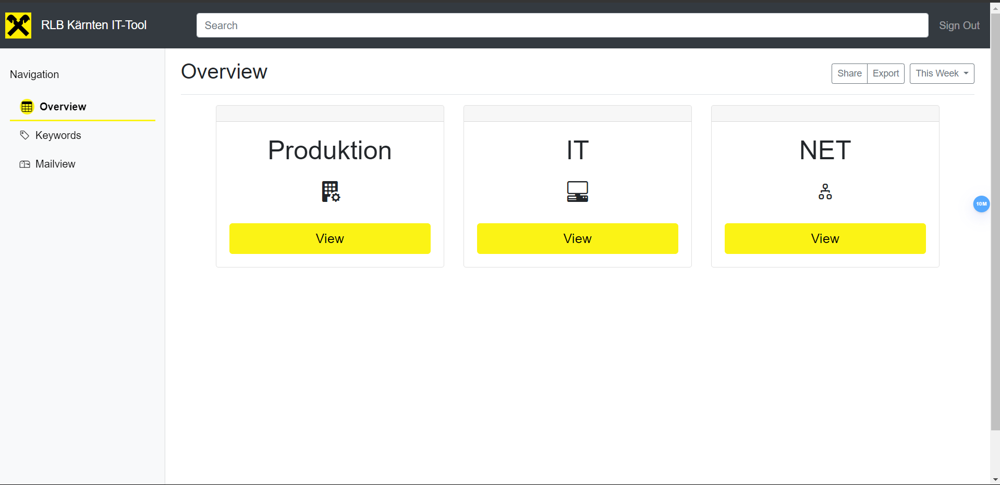

# README - RLB Check_TOOL

> Date: 21.08.2024


## Table of Contents
- [README - RLB Check\_TOOL](#readme---rlb-check_tool)
  - [Table of Contents](#table-of-contents)
  - [General info](#general-info)
  - [Technologies](#technologies)
  - [Launch](#launch)
    - [Docker Commands:](#docker-commands)
    - [Starting the Application](#starting-the-application)
  - [Application Overview](#application-overview)
    - [Main Page](#main-page)
    - [User Roles](#user-roles)
    - [Worker Workflow](#worker-workflow)
    - [Admin Capabilities](#admin-capabilities)
  - [Database](#database)
    - [Structure](#structure)
    - [Stored Procedures](#stored-procedures)
  - [Illustrations](#illustrations)
    - [Login Page](#login-page)
    - [Overview](#overview)
    - [Keywords](#keywords)
    - [Mailview](#mailview)
  - [Sources](#sources)
    - [Frontend](#frontend)
    - [Backend](#backend)

## General info

This application was developed by **Mathias Gombos** to replace the old HCL Notes application.

The goal of this project is to combine the existing tools `check_it`, `check_net`, and `check_prod` into a single, modern solution with some new features.

 This unified application aims to streamline processes and enhance functionality, providing a more efficient and user-friendly experience for all users.

 ## Technologies

 - **MySQL** - Version: 8.0.39 
 - **Express** - Version: 4.19.2
 - **Angular** - Version: 18
 - **NodeJs** - Version: 20.15.0
  
*Further information about additional technologies/libraries can be found in `package.json`*

## Launch

To get the application up and running, follow these steps:

### Docker Commands:

- **Check if Docker container is running:**
  
    `docker ps`


- **Create Docker container:**
  
    `docker create --name mysql-prod -e MYSQL_ROOT_PASSWORD=rootpassword -e MYSQL_DATABASE=checkdb -p 3306:3306 mysql:latest`


- **Start Docker container:**
  
    `docker start mysql-prod`


- **Stop Docker container:**
  
    `docker stop mysql-prod`


- **Stop Docker container:**

    `docker rm -f mysql-prod`

---

### Starting the Application

*Make sure that the Database is available!*

- **Insert Demo Data:**
  ```bash
  cd backend
  npm run fill-demo-data
  ```

- **Start Backend:**

  ```bash 
  cd backend
  ```
  - client mode:
    `npm start`
  - developer mode:
    `npm run dev`

- **Build Frontend:**
    ```bash
    cd frontend
    npm run build:prod
    ```

Application is running on `http://localhost:8080`


## Application Overview

### Main Page

This application features three main pages that facilitate different aspects of the workflow:

1. **Overview**: [more](#overview) 
   
   Provides a summary of all checks, highlighting the current day's check at the top. 
   It displays how many keywords have been checked, by whom, and which ones remain unchecked.

2. **Keywords**: [more](#keywords) 
   
   Lists all the keywords relevant to the user’s department. Users can view, edit, delete, or add keywords (only for their own department).

3. **Mailview**: [more](#mailview) 
   
   Displays emails received by the department. Each email contains information about keywords that need to be reviewed. Users can read the emails, check the associated files, and update the status of the keywords as needed.

### User Roles

There are two types of users in the application:

- **Admin**: 
  
  - Has full access to all features and can manage all departments.
  
  -  Admins can view and edit any checks and keywords across all departments. 
  
  -  If a check is not completed on time, Admins can manually update the status using a backdoor feature.

- **Worker**: 
  
  - Has restricted access based on their department. 

  - Workers can only view and manage checks and keywords relevant to their own department. 

  - They can view emails, check keywords, and leave comments if necessary. 

  - Workers are responsible for ensuring that all keywords for the current day's check are reviewed. 

### Worker Workflow

1. **Review Emails**: 
   
   Workers start by checking the Mailview page for emails specific to their department. These emails contain information about keywords that need to be checked.

2. **Process Keywords**: 
   
   Workers read the emails and review the associated files. They check off the keywords they are responsible for and can add comments if necessary.

3. **Update Check**: 
   
   After processing, Workers update the status of the check for the current day.

4. **Monitor Progress**: 
   
   In the Overview page, Workers can see all checks, with the current day's check displayed prominently. They can view the status of each keyword and see who has completed their checks.

5. **End-of-Day Reminder**: 
   
   At the end of the day, if any keywords remain unchecked past 6 PM, a sticky notification will remind Workers every 5 minutes until the check is completed.

### Admin Capabilities

Admins have comprehensive access and can:

- Manage all checks and keywords across any department.

- Use a backdoor feature to manually mark missing keywords as checked if a daily check is incomplete.


## Database 

The database is designed to store information about checks, keywords and persons (users)

### Structure

*Database - Logical Model*


*Database - Conecptional Model*


### Stored Procedures

**Calls**:

```sql
    -- DELETES EXISTING PERSONS + AUTO-INCREMENT = 1
    CALL DeletePersonRecords();
    ALTER TABLE `Persons` AUTO_INCREMENT = 1;

    -- DELETES EXISTING KEYWORDS + AUTO-INCREMENT = 1
    CALL DeleteKeywordRecords();
    ALTER TABLE `Keywords` AUTO_INCREMENT = 1;

    -- DELETES EXISTING MIDTABLE (Keywords + Persons)
    CALL DeleteKeywordPersonMidtableRecords();

    -- DELETES EXISTING MIDTABLE (Checks + Keywords)
    CALL DeleteCheckKeywordMidtableRecords();

    -- DELETES EXISTING CHECKS
    CALL DeleteCheckRecords();
    ALTER TABLE `Checks` AUTO_INCREMENT = 1;
```

## Illustrations

### Login Page


### Overview

*This Overview is only available for the admin*


*check-protocol: admin and worker*


*check-detailview: admin and worker*


*check-detailview-backdoor: admin - backdoor function*


### Keywords
*Keywords: worker*


*Keywords: admin*


*Keyword-Edit: worker and admin*


*Keyword-Add: worker (admin can choose the department)*


### Mailview
*Mailview: worker and admin*


*Mail-Detailview: worker and admin*


## Sources

### Frontend

- [Angular Docs](https://angular.dev/overview)

- [Bootstrap Docs](https://getbootstrap.com/docs/5.3/getting-started/introduction/)

- [Bootstrap Icons](https://icons.getbootstrap.com/)

### Backend

- [MySQL connection](https://www.w3schools.com/nodejs/nodejs_mysql.asp)

- [MySQL docs](https://www.w3schools.com/MySQL/default.asp)

- [MDN Docs (JS/TS)](https://developer.mozilla.org/en-US/docs/Glossary/JavaScript)
  
- [npm Cron](https://www.npmjs.com/package/cron)


